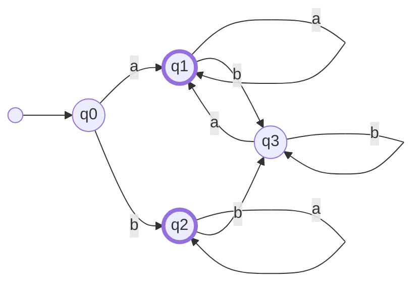
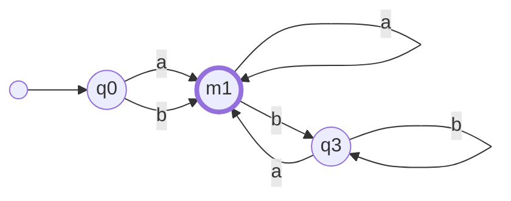

# Project 1：DFA 最小化

## 实验目的

我们在 FLA 课程中学习了将 DFA **最小化** 的方法，让我们编码实现它！

希望通过这次实验，让大家：

- 理解 **确定性有穷自动机 (DFA)** 的形式化定义
- 掌握 **DFA 最小化** 的基本原理


## 实验描述

你需要用 C++ 实现⼀个 Linux 下运行的命令行工具 `min_dfa`，将一个输入的 DFA 转换为 **等价** 且 **状态数最少** 的 DFA 并输出。

### 任务

1. **最小化算法**

   - 你需要实现一个 DFA 最小化算法，使得输出的 DFA:
     1. 与输入等价，即能接受与输入 DFA 完全相同的语言
     2. 具有最少的状态数
     3. 没有不可达状态

2. **输入、输出与运行**

   - 我们提供了 DFA 的形式化定义及其语法，见附录，DFA 以文件方式读入与输出，相关文件带有  `.dfa` 后缀

     - 输入：我们确保提供的输入文件符合语法，且不会有语法错误
     - 输出：你的输出也应符合规定的语法

   - 你的程序应命名为 `min_dfa`，并能通过以下方式运行：

     ```bash
     ./min_dfa <input_file> <output_file>
     ```

     注：程序应该使用 **相对路径** 来读取输入文件和写入输出文件。`<input_file>` 和 `<output_file>` 参数在测试时由测试脚本提供，请确保程序能够正确处理相对路径的文件访问，也即，不要在你的程序里硬编码你放置的文件或目录

### 补充

1. **编程语言**：仅支持 C++ 语言，详细信息参考 `README.md`
2. **操作系统**：请使用 Linux 系统 (如果你之前没接触过 Linux 系统，WSL2 足够完成本课程所有编程任务，推荐使用)，我们不支持 Windows 系统测试，详细信息参考 `README.md`
3. **用户友好**：你的命令行工具被相关测试脚本调用，请 **不要** 在标准输出中打印额外的信息 (如调试信息、日志)


### 样例

输入文件 `example.dfa`：

```
; Example DFA
#Q = {q0,q1,q2,q3}
#S = {a,b}
#q0 = q0
#F = {q1,q2}

; transitions
q0 a q1
q0 b q2
q1 a q1
q1 b q3
q2 a q2
q2 b q3
q3 a q1
q3 b q3
```

对应自动机：



在项目根目录运行如下命令（假设相关文件均在根目录下）：	

```bash
./bin/min_dfa example.dfa output.dfa
```

你应当向文件 `output.dfa` 写入下面内容：

```
#Q = {q0,m1,q3}
#S = {a,b}
#q0 = q0
#F = {m1}

q0 a m1
q0 b m1
m1 a m1
m1 b q3
q3 a m1
q3 b q3
```

​	对应自动机：



​	注：状态命名只需要符合附录的语法。例如，如下内容也被视为正确：

```
#Q = {m0,m1,m2}
#S = {a,b}
#q0 = m0
#F = {m1}

m0 a m1
m0 b m1
m1 a m1
m1 b m2
m2 a m1
m2 b m2
```

​	

## 实验提交

> 重要声明：为维护学术诚信，我们将对所有提交代码进行查重！请各位同学务必独立完成本项目！

- 上传
  - 请将压缩包命名为 `学号_姓名_FLA25proj1.zip` 上传至 https://box.nju.edu.cn/u/d/3d3734ad5cca43b2ab6e/。
  - 压缩包的**具体格式**要求参考 `README.md`，**请仔细阅读其中的要求。**
- 联系
  - 实验相关问题请优先联系群聊里的钱子隽与仓世鸿助教

<font size = 5> 提交截止日期：`2025.11.11 23:59:59` </font>


## 附录 DFA (`.dfa` 文件)语法

DFA 的形式化描述为 $M=(Q, \Sigma, \delta, q_0, F)$。下面定义的程序语法完整地刻画了这五部分内容。

1. **状态集 Q**: 以 `#Q` 开头。**占据（且仅占据）DFA 程序的一行**（即不包括回车换行)； `#` 为该行的第一个字符（以下 2 - 4同）；各状态之间以英文逗号 `,` 分隔。状态用一个或多个非空白字符（字母 `a-z` ， `A-Z` 、数字 `0-9` 和下划线 `_` ）表示，如 `10`、`a`、`state1`等。语法格式为 `#Q = {q1,q2,...,qi}`。等号`=` 两边各有一个空格（以下 2 - 4 同）。
   示例：

   ```
   #Q = {0,cp,cmp,mh,accept,accept2,reject}
   ```

2. **输入符号集 Σ**: 以 `#S` 开头，各符号之间以英文逗号 `,` 分隔。语法格式为 `#S = {s1,s2,...,sj}`。输入符号的可取值范围为除 `' ' (space)`、`','`、`';'`、`'{'`、`'}'`、`'*'`、`'_'` 外的所有 **ASCII 可显示字符** (定义参见 ***[维基百科](https://zh.wikipedia.org/wiki/ASCII )***)。

   示例：

   ```
   #S = {1,2,a,b}
   ```

3. **初始状态 q0**: 以 `#q0` 开头。语法格式为 `#q0 = q`。

   示例：

   ```
   #q0 = 0
   ```

4. **终结状态集 F**: 以 `#F` 开头，各状态之间以英文逗号` , `分隔。语法格式为 `#F = {f1,f2,...,fn}`。

   示例：

   ```
   #F = {accept}
   ```

5. **转移函数 δ**: 每一条转移函数**占用且仅占用一行**，行内容为⼀个三元组，格式为：`<旧状态> <输入符号> <新状态>`。各部分以一个空格分隔。

   - **(新、旧) 状态** 定义见 **状态集**。
   - **输⼊符号** 定义见 **输⼊符号集**。

   示例：

   ```
   q0 a q1
   ```

6. **注释和空行**: 注释以英文分号 `';'` 开头。在解析程序时应当忽略注释和空行。

   示例：

   ```
   ;这是一行注释，下面是空行。你在解析时应忽略注释和空行。
   
   #Q = {s0,s1} ;这也是注释
   ```

   

**`.dfa` 文件示例**

```
; This DFA accepts strings with an even number of 'a's.
#Q = {s0,s1}
#S = {a,b}
#q0 = s0
#F = {s0}
s0 a s1
s0 b s0
s1 a s0
s1 b s1
```